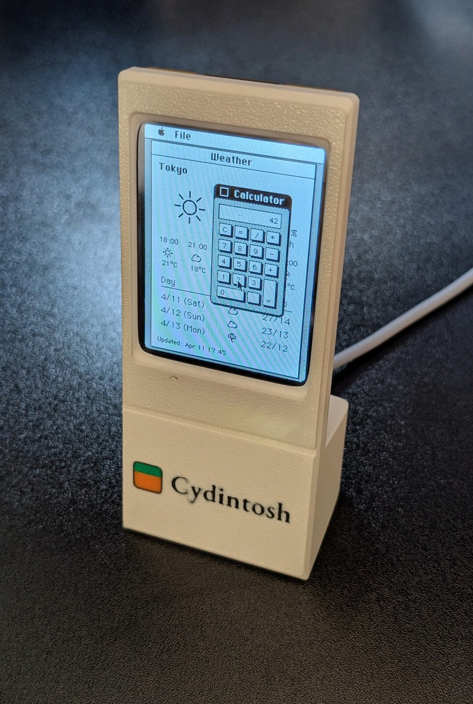
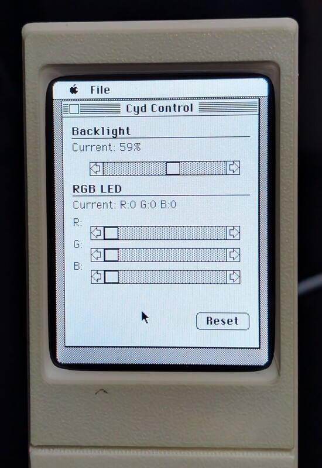
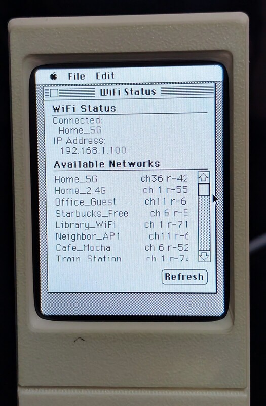
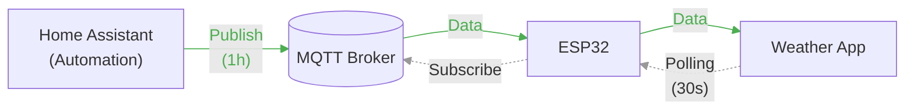

<div>


</div>

# Cydintosh

A Macintosh Plus emulator port for Cheap-Yellow-Display board (ESP32), with some little 68k Mac applications.

- Macintosh Plus emulation using umac and Musashi 68k emulator
- 240x320 LCD with touchpad emulation for mouse control
- *Homebrew* Mac applications built with Retro68 (Weather, WiFi status, etc.)
- IPC between Mac and ESP32 (WiFi scan, MQTT weather data)

## Hardware BOM

| Component                | Quantity | Notes                                         |
| ------------------------ | :------- | :-------------------------------------------- |
| CYD2USB (ESP32-2432S028) | 1        | ESP32 with ILI9341 240x320 LCD, XPT2046 touch |
| M2x3 Self-Tapping screw  | 4        | For enclosure assembly                        |

> Note: The enclosure is only compatible with the [CYD2USB](https://github.com/witnessmenow/ESP32-Cheap-Yellow-Display/blob/main/cyd.md) (Type-C + micro USB) variant.

## Getting Started

1. **Flash**: See [Building](#building) or [VS Code](#vscode) to build and flash the firmware/ROM/disk image
2. **Print**: 3D print the enclosure from [`./enclosure`](./enclosure)
3. **Assemble**: Mount the CYD into the enclosure and secure with four M2x3 self-tapping screws

## Prerequisites for Emulator

- Mac Plus ROM v3 (4D1F8172, 128KB) `rom.bin`
- System 3.2 bootable disk image (400KB)
- HFS disk image (800KB `cyd_800k.dsk` provided, includes pre-built Mac apps for Cydintosh)

See also the [pico-mac](https://github.com/evansm7/pico-mac) repo for ROM and disk image requirements.

## Building

```bash
# Clone and initialize submodules
git clone --recursive https://github.com/likeablob/cydintosh
cd cydintosh

# If you cloned without --recursive, initialize submodules:
git submodule update --init --recursive

# Setup m68k configuration
(cd external/umac/external/Musashi && ln -sf ../../../../include/m68kconf.h m68kconf.h)

# Generate m68kops.c
(cd external/umac && make prepare)

# Create user configuration
cp include/user_config.h.tmpl include/user_config.h
# Edit include/user_config.h with your WiFi/MQTT settings

# Generate and flash patched ROM
# NOTE: Specify the correct serial port depending on your setup/OS
python3 tools/generate_patched_rom.py path/to/rom.bin -o rom_patched.bin
esptool --port /dev/ttyUSB0 write_flash 0x210000 rom_patched.bin

# Prepare disk image
# The cyd_800k.dsk includes pre-built Mac applications (CydCtl, Weather, WiFi).
# To create a fresh disk with System 3.2 using Mini vMac emulator:
#   ./Mini\ vMac system3.dsk cyd_800k.dsk
#   Then copy System folder from system3.dsk to cyd_800k.dsk in the emulator

# Finally, copy the prepared disk to data/disk.img
cp cyd_800k.dsk data/disk.img

# Build and upload firmware
# For the CYD (micro USB) variant, use `-e cyd`
# Add a new [env:xxx] section to platformio.ini for other minor variants.
pio run -e cyd2usb -t upload


# Upload disk image
pio run -e cyd2usb -t uploadfs
```

## VS Code

Firmware development uses [VS Code](https://code.visualstudio.com/) with the **PlatformIO IDE** extension. The repo includes [.vscode/extensions.json](.vscode/extensions.json), so VS Code may prompt you to install PlatformIO when you open the folder.

1. **Open the project**: **File → Open Folder** and choose the repository root (the directory that contains `platformio.ini`).
2. **Install PlatformIO** from the notification or install the **PlatformIO IDE** extension from the Marketplace.
3. **First build**: Open the PlatformIO sidebar (alien icon). Under **Project Tasks → env:cyd2usb** (matches the CYD2USB board), run **General → Build**. The first build downloads the Espressif platform, ESP-IDF, toolchain, and dependencies from `src/idf_component.yml`.
4. **Upload and monitor**: Use **Upload** and **Monitor** under the same environment. To push the LittleFS disk image to flash, run **Upload Filesystem Image** (same as `pio run -e cyd2usb -t uploadfs`).
5. **Serial port**: If the upload port is wrong, set it in `platformio.ini`, for example `upload_port = COM3` under `[env:cyd2usb]` on Windows (find **COM** ports in **PlatformIO → PIO Home → Devices** or Device Manager). On Linux or WSL, devices are usually `/dev/ttyUSB0` or `/dev/ttyACM0`.

**Windows vs WSL:** Running VS Code **on Windows** with the project folder on the Windows filesystem gives the simplest USB serial experience. If you use **Remote - WSL**, USB serial is not available to Linux unless you attach the device with [usbipd-win](https://learn.microsoft.com/en-us/windows/wsl/connect-usb); after attaching, use the reported `/dev/tty*` path as `upload_port`.

Submodule setup, `make prepare`, ROM patching, and preparing `data/disk.img` are unchanged — follow [Building](#building) for those steps whether you use the terminal or VS Code.

To use the Weather app, continue with [Home Assistant Setup](#home-assistant-setup).

## Development

```bash
# Format tracked C/C++ files
mise run format

# Check formatting without changes
mise run format:check

# Watch serial logs
pio device monitor
```

## Mac Applications

*Homebrew* Mac applications for Cydintosh.

| App     | Description                           |
| ------- | ------------------------------------- |
| Weather | Weather display via MQTT              |
| CydCtl  | Hardware control (backlight, RGB LED) |
| WiFi    | WiFi status and scan                  |

<div>



</div>

### ESP32-Mac IPC Interface

The ESP32 exposes a command interface via memory-mapped region at `0xF00000`. Mac applications read/write this shared memory to communicate with ESP32:

| App     | Commands                                           |
| ------- | -------------------------------------------------- |
| Weather | `GET_WEATHER_DATA` ...                             |
| CydCtl  | `GET_HW_STATE`, `SET_BACKLIGHT`, `SET_LED_RGB` ... |
| WiFi    | `GET_WIFI_LIST`, `GET_WIFI_STATUS` ...             |

See `include/umac_ipc.h` and `mac-app/common/esp_ipc.h` for full command definitions.

### Weather App



1. Home Assistant automation publishes weather data to MQTT every hour
2. ESP32 subscribes to MQTT topics and stores received data
3. Weather App polls ESP32 via IPC every 30s and renders the data

#### Home Assistant Setup

You need to set up MQTT and a weather integration in Home Assistant to use the Weather app.

- [MQTT Integration](https://www.home-assistant.io/integrations/mqtt/)
- [Weather Integrations](https://www.home-assistant.io/integrations/#weather)
- [Definitive guide to Weather integrations (Community)](https://community.home-assistant.io/t/definitive-guide-to-weather-integrations/736419)


1. In Home Assistant, go to **Settings > Automations > Create Automation > Edit YAML**
2. Paste the content of [`homeassistant/weather_to_mqtt.yaml`](homeassistant/weather_to_mqtt.yaml)
3. Edit the variables:
   ```yaml
   variables:
     weather_entity: "weather.home"
     topic_prefix: "home/weather"
     location: "Chicago"
   ```

Optionally, add the [`homeassistant/brightness_schedule.yaml`](homeassistant/brightness_schedule.yaml) automation for time-based display dimming.

#### ESP32 Configuration

- WiFi, MQTT broker credentials, and weather display units etc. are configured in [`include/user_config.h`](include/user_config.h.tmpl).
- The device expose entities (e.g. display brightness) via [HA MQTT Discovery](https://www.home-assistant.io/integrations/mqtt/#mqtt-discovery).

```c
...
#define WIFI_SSID       "YOUR_WIFI_SSID"
#define WIFI_PASSWORD   "YOUR_WIFI_PASSWORD"

#define MQTT_BROKER_URL "mqtt://192.168.1.100:1883"
#define MQTT_USERNAME   "YOUR_MQTT_USERNAME"
#define MQTT_PASSWORD   "YOUR_MQTT_PASSWORD"
...

#define HA_DISCOVERY_PREFIX  "homeassistant"
...

#define WEATHER_TEMP_UNIT \
    "\xA1"                \
    "C"
```

### Updating the Disk Image Manually

```bash
# Rebuild applications and update disk image
./tools/update-disk.sh data/disk.img

# Re-upload disk image
pio run -e cyd2usb -t uploadfs
```

## Gallery

<div>


</div>

## Acknowledgements

- [Musashi](https://github.com/kstenerud/Musashi) - m68k emulator
- [umac](https://github.com/evansm7/umac) - Mac Plus emulator core
- [pico-mac](https://github.com/evansm7/pico-mac) - Reference implementation for RP2040
- [ESP32-Cheap-Yellow-Display](https://github.com/witnessmenow/ESP32-Cheap-Yellow-Display) - CYD community
- For dependencies, see also src/idf_component.yml

## License

- **Software**: MIT
- **External libraries**: See respective licenses in `external/`

## TODO

- [ ] Better icons for mac-apps

## Related Projects

- [likeablob/denki-kurage](https://github.com/likeablob/denki-kurage): Another CYD-based gadget
- Macbar (WIP):  ESP32-S3 port utilizing PSRAM
- Macbento (WIP)
